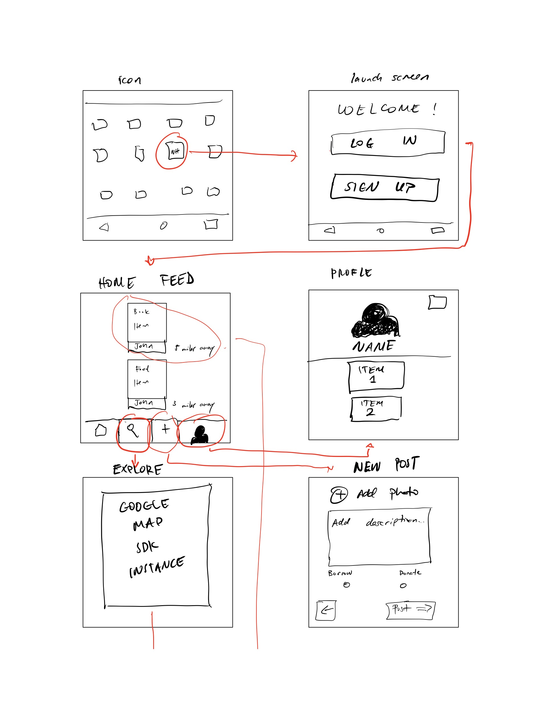
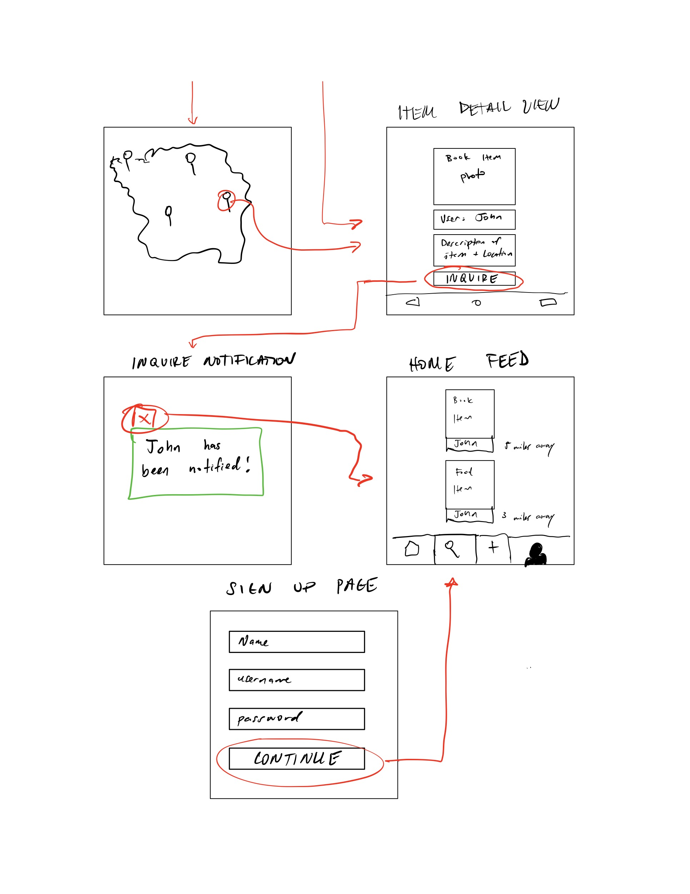

# NextHand

## Table of Contents
1. [Overview](#Overview)
1. [Product Spec](#Product-Spec)
1. [Wireframes](#Wireframes)
2. [Schema](#Schema)

## Overview
### Description
This app will provide users with the ability to share items and borrow/donate items posted online. Have an extra carton of milk you don't want to spoil? An old pair of jeans in the closet that no longer fit? Post them on your profile and have someone in the area arrange a time to pick them up! 

### App Evaluation
[Evaluation of your app across the following attributes]
- **Category:** Social / Photo + Video/ Marketplace
- **Mobile:** Website is view only, uses camera, mobile first experience.
- **Story:** Allows users to share and borrow items and food.
- **Market:** Anyone with a mobile device with a camera and internet connection can download and use this app.
- **Habit:** Users can make a post whenever they notice they have some things lying around that they either wish to be donated or to have borrowed for a short period of time. 
- **Scope:**
    
## Product Spec

### 1. User Stories (Required and Optional)

**Required Must-have Stories**

* Users can create an account and setup a profile.
* Users can use their camera to upload items to their profile.
* Users can view a feed of items that are posted within their area. 
* Users can view a map of their surrounding area with pinpoints of items up for borrow/donation.
    * Users can distinguish between items they no longer need (for donation) and items only for borrowing as they post.
* Users can press "inquire" on an item on their feed, which triggers a notification to the author of the post. That author can accept or reject the inquiry. If the author accepts, the interested user will be able to view the author's phone number and email information to  coordinate the details of picking up an item.


**Optional Nice-to-have Stories**

* Users can search for items (and have results displayed within a certain radius)
* Users can initiate a private chat with another user who is interested in an item they post.

### 2. Screen Archetypes

* The first screen will be the login and registration plan.
   * Associated with the "Users can create an account and setup a profile" user story. 
* The second screen will be the "home" page.
   * Associated with the user stories "Users can use their camera to upload items to their profile, Users can view a feed of items that are posted within their area, Users can follow profiles and view items posted from their followers, displayed on a seperate tab, and Users can view a map of their surrounding area with pinpoints of items up for borrow/donation."

### 3. Navigation

**Tab Navigation** (Tab to Screen)

* The first tab is "Home Feed", which displays a personalized feed of items.
* The second tab is "Map", which displays an interactive map with markers of items nearby the current user. Tapping on a marker loads the "details" view of a post.
* The third tab is "Post", where users can upload a photo of an item, fill out details about the item, and post to their profile. 
* The fourth tab is "Profile", where users can view their own posts and adjust settings to their profile.

**Flow Navigation** (Screen to Screen)
 
* The first screen will the Login/Registration screen. Users will have the option to login if they already have an account, or register for one if they do not already have one.
   * The registration screen will ask for details about the user including name, email, username, and password.
   * Upon login/after successful registration, users will be directed to the second screen.
* The second screen opens up the user's "Home" feed, with a BottomNavigationView containing each tab.
   * Users can select on a tab to switch to a different screen, each described [above](#3-Navigation)

## Wireframes
[Add picture of your hand sketched wireframes in this section]




## Schema 
### Models
#### Item

   | Property      | Type     | Description |
   | ------------- | -------- | ------------|
   | objectId      | String   | unique id for the user post (default field) |
   | author        | Pointer to User| image author |
   | image         | File     | image that user posts |
   | caption       | String   | image caption by author |
   | donation | Boolean   | flag that determines whether or not an item is up for donation (true) or borrowing (false) |
   | location    | String   | latitude and longitude coordinates of the location of the user *at the time of posting* |
   | inquiries   | JSONArray | array of pointers to user objects that signal which users have inquired about an item|
   | category     | String |  categorical description of the item
   | isAvailable    | Boolean | flag that determines if an item is still available (True) or has been given away (False)
   | createdAt     | DateTime | date when post is created (default field) |
   | updatedAt     | DateTime | date when post is last updated (default field) |
   
#### User

   | Property      | Type     | Description |
   | ------------- | -------- | ------------|
   | objectId      | String   | unique id for the user post (default field) |
   | username        | String | screen name of the user |
   | password        | String | password of the user    |
   | profileImage         | File     | profile image of user |
   | phoneNumber       | String   | phone number of user |
   | emailAddress      | String   | email address of user|
   | createdAt     | DateTime | date when user is created (default field) |
  
### Networking
#### List of network requests by screen
   - Home Feed Screen
      - (Read/GET) Query all posts where user is author
         ``` java
            protected void queryPosts() {
                //Specify which type of data we want to query - Post.class
                ParseQuery<Item> query = ParseQuery.getQuery(Item.class);

                //Include the data referred by user key
                query.include(Post.KEY_USER);

                //Limit query to 20 posts
                query.setLimit(20);

                //Order posts by location 
                query.addDescendingOrder("location");

                //Fetch the 'Item' data asynchronously
                query.findInBackground(new FindCallback<Post>() {
                    @Override
                    public void done(List<Post> posts, ParseException e) {
                    /* TODO: callback (involves clearing and adding data 
                     to our ItemsAdapter for our feed) */
                    }
                });
            }
        ```
      - (Create/POST) Create a new inquiry on a post
   - Create Item Screen
      - (Create/POST) Create a new item object
   - Profile Screen
      - (Read/GET) Query logged in user object
      - (Read/GET) Query inquiries from other users
      - (Update/PUT) Update user profile image
